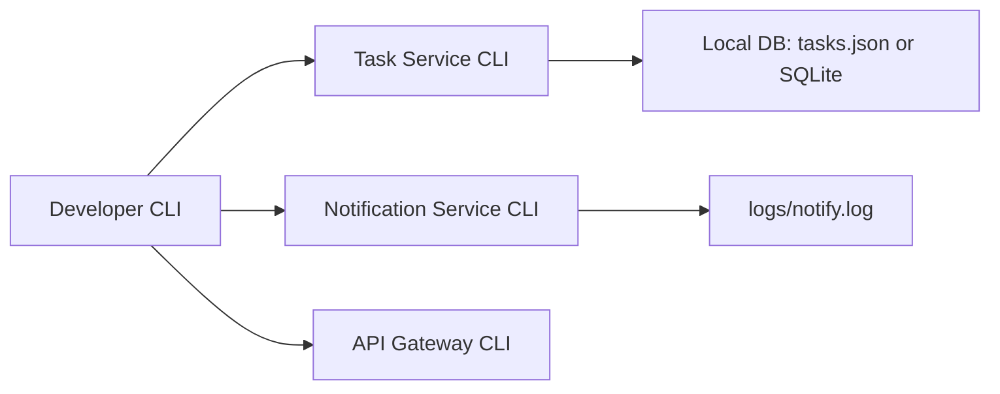

# MiniTasks — Архитектурное описание (Bun CLI)

## 1. Введение
**MiniTasks** — учебный проект, предназначенный для практики микросервисной архитектуры и основ разработки на **Bun + TypeScript**.  
В этой версии MiniTasks реализуется как **набор автономных CLI-приложений** (каждый сервис — отдельный Bun-проект). Проект служит как шаблон для отработки процессов и шаблонов: инициализация сервисов, локальная разработка, независимая доставка и простая интеграция.

Документ оформлен в духе Software Architecture Document (SAD) и описывает цели, требования, архитектурные решения и рекомендации по развитию.

---

## 2. Цель и область применения
**Цель:** дать компактную и воспроизводимую базу для изучения архитектуры микросервисов и организации нескольких Bun CLI-приложений в одном репозитории.

**Область применения:** локальная разработка, обучение, демонстрация взаимодействия сервисов через HTTP/локальные вызовы и подготовка к контейнеризации.

---

## 3. Стейкхолдеры
- **Разработчик (ты)** — основная аудитория, использующая проект для обучения и экспериментов.
- **Инфраструктурный инженер** — при расширении до продакшена (контейнеризация, CI/CD).
- **Ревьювер/ментор** — оценивает архитектуру, код, практики.

---

## 4. Требования

### 4.1 Функциональные
- Создание задач (task): `mini-tasks task create --title "..." --desc "..."`.
- Получение списка задач: `mini-tasks task list`.
- Обновление статуса/поля задачи: `mini-tasks task update --id <id> --done`.
- Удаление задачи: `mini-tasks task delete --id <id>`.
- Опционально: экспорт/импорт задач в JSON.

### 4.2 Нефункциональные
- Лёгкая изоляция сервисов (каждый — свой Bun проект).
- Быстрый старт: `bun run dev` в каталоге сервиса.
- Простая локальная разработка без внешних зависимостей (по умолчанию использовать встроенный файл DB: JSON/SQLite).
- Ясная структура кода и конфигурации.

---

## 5. Ограничения
- Это учебная база — безопасность, масштабирование и отказоустойчивость реализованы минимально.
- По умолчанию используется файловая база (JSON/SQLite). Для серьезных нагрузок нужна внешняя БД.
- CLI-ориентированность — взаимодействие через HTTP минимально (опционально).

---

## 6. Высокоуровневая архитектура

Проект организован как **монорепозиторий**, внутри которого находятся независимые Bun-проекты:

```
mini-tasks/
├─ api-gateway/            # опционально: CLI wrapper или прокси
├─ task-service/           # Bun CLI сервис управления задачами (основной)
├─ notification-service/   # Bun CLI сервис логирования/уведомлений (опционально)
├─ tools/                  # вспомогательные утилиты (скрипты, миграции)
└─ README_ARCHITECTURE.md
```

Каждый сервис содержит:
- `package.json` / `bun.lockb`
- `src/index.ts`
- `tsconfig.json`
- `README.md` (локальный для сервиса)

### Взаимодействие
Так как это CLI-ориентированный шаблон, взаимодействие минимально:
- Команды `task-service` работают с локальной БД.
- `notification-service` может вызываться локально либо через CLI hook: `bun run notify --message "..."`
- Для экспериментов добавить `api-gateway` как CLI-прокси, пересылающий HTTP-запросы локально (если потребуется).

---

## 7. Компоненты и их ответственность

### 7.1 Task Service (CLI)
- **Ответственность:** CRUD для задач, хранение данных.
- **Интерфейс:** CLI команды (`task create|list|update|delete|export|import`).
- **Хранение:** `data/tasks.json` или `data/tasks.db` (SQLite).
- **Запуск разработки:** `bun run dev` (или `bun run start`).

### 7.2 Notification Service (CLI)
- **Ответственность:** логирование уведомлений, демонстрация межсервисных уведомлений.
- **Интерфейс:** `notify send --text "New task created: ..."` or read from stdin.
- **Поведение:** вывод в консоль и записи в файл `logs/notify.log`.

### 7.3 API Gateway (опционально)
- **Ответственность:** единая точка запуска для цепочек команд, прокси для HTTP (если добавляешь web-часть).
- **Интерфейс:** CLI wrapper `mini-tasks` с подкомандами `task` и `notify`, упрощающий использование.

---

## 8. Детали реализации

### 8.1 Структура кода (пример для task-service)
```
task-service/
├─ package.json
├─ tsconfig.json
├─ src/
│  ├─ index.ts         # точка входа: парсинг аргументов, маршрутизация команд
│  ├─ commands/
│  │  ├─ create.ts
│  │  ├─ list.ts
│  │  └─ update.ts
│  ├─ storage/
│  │  ├─ jsonStorage.ts
│  │  └─ sqliteStorage.ts
│  └─ models/
│     └─ task.ts
└─ data/
   └─ tasks.json
```

### 8.2 Пример модели задачи (TypeScript)
```ts
type Task = {
  id: string;            // UUID
  title: string;
  description?: string;
  createdAt: string;     // ISO date
  updatedAt?: string;
  done: boolean;
  meta?: Record<string, any>;
}
```

### 8.3 CLI-парсер
Рекомендуется использовать минимальную зависимость: например, `clipanion` или `commander` (вес небольшой). Для обучения можно написать собственный парсер.

---

## 9. Нефункциональные качества

### 9.1 Модульность
Каждый сервис полностью изолирован: свои зависимости, тесты, конфиги.

### 9.2 Простота разработки
`bun` обеспечивает быстрый запуск и лёгкую замену зависимостей. По умолчанию сохранять минимальные зависимости.

### 9.3 Трассируемость
Логирование в каждом сервисе (stdout + файл). Для простоты использовать структурированный JSON-лог.

### 9.4 Тестируемость
- Юнит-тесты для модулей (model, storage, команды).
- Интеграционные тесты: вызвать команды через `bun` в тестовой среде со временной БД.

---

## 10. DevOps и CI/CD (рекомендации)
- Настроить GitHub Actions / GitLab CI:
  - Workflow: `install` → `lint` → `build` → `test`.
  - Параллельные job'ы для каждого сервиса.
- Артефакты: архивы сервисов или Docker images (опционально).
- Перед релизом переводить файловую БД на SQLite или внешнюю БД.

---

## 11. Планы развития
- Добавить HTTP-интерфейс для таск-сервиса (мини-API) для практики сетевого взаимодействия.
- Включить простую очередь (Redis/RabbitMQ) для асинхронных уведомлений.
- Забоксировать сервисы в Docker, добавить `docker-compose.yml`.
- Добавить пример CI с автоматическим lint/test и публикацией release.

---

## 12. Контакты и лицензия
Автор: **Andrey Sykalov**  
Лицензия: MIT (рекомендуется для учебных проектов)

---

## 13. Диаграммы (Mermaid)
Ниже — mermaid-диаграмма, которую можно визуализировать в Markdown-рендерере, поддерживающем Mermaid.



---

Конец документа.  
